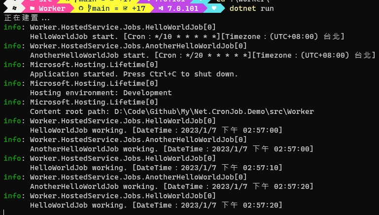
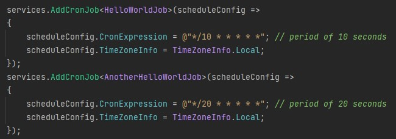

# Net.CronJob.Demo

> 這個專案專注於實作排程工作機制。  
> This project focus on implement cron job mechanism.

練習實作排程工作機制於 .NET 上。  
To practice how cron job mechanism implement on .NET.

## 運行專案

> 透過 Visual Studio 2022 或者利用 `dotnet run` 指令先把專案跑起來。

1. Run the project from Visual Studio 2022 or by typing `dotnet run` in a command window.

> 回到命令列視窗，你將會看到以下訊息：

2. Back to command window, your will see the message:  
   

> 自己試試看。

3. Try it yourself.  
   

> 提示：試著想想看排程工作其實是背景服務。

Tips: Try to think about cron job is worker service.

## 參考

- [CronJobService.cs](https://gist.github.com/changhuixu/47ffb441575564b57e6446bb59466300)
- [Cron Expression Descriptor](https://bradymholt.github.io/cron-expression-descriptor/)
